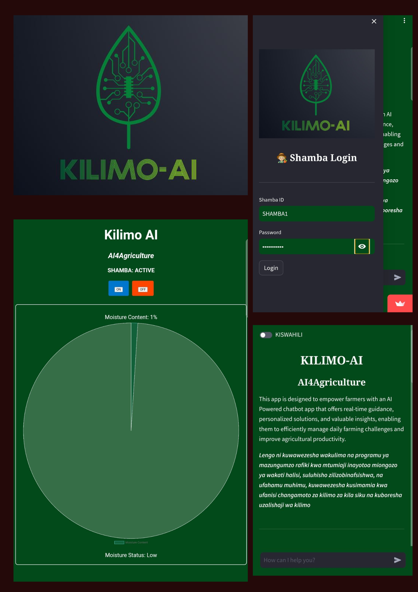

## Kilimo-AI

Kilimo-AI is an GenAI-powered tool developed to help farmers in remote areas access specialized and personalized advice on agricultural issues with utmost accuracy. Using Large Language Models (LLMs) trained on agricultural datasets, Kilimo-AI generates answers to any question posed by a farmer. Additionally, it offers features such as a Kiswahili Translator, making it suitable for most Kenyan rural farmers who understand Swahili. Built on Streamlit, Kilimo-AI facilitates the integration of IoT systems like smart irrigation systems and other tools.

### Features

- AI-Powered Advice: Get accurate, specialized answers to your agricultural questions.
- Kiswahili Translator: Perfect for farmers who are more comfortable with Swahili.
- IoT Integration: Connect and control systems like smart irrigation.

### Getting Started
Follow these instructions to get a copy of Kilimo-AI up and running on your local machine for development and testing purposes.

#### Prerequisites
- streamlit==1.26.0
- langchain==0.0.210

#### Installation
1. Clone the repository:
~~~
git clone https://github.com/your-username/kilimo-ai.git
~~~

2. Navigate to the project directory:
~~~
cd kilimo-ai
~~~
3. Install the dependencies:
~~~
pip install -r requirements.txt
~~~
4. Running Kilimo-AI
To start the Kilimo-AI application, run:
~~~
streamlit run app.py
~~~

#### Usage
- Ask Questions: Simply type your agricultural questions in the input box and receive AI-generated answers.
- Translate to Swahili: Use the translation feature to get responses in Kiswahili.
- Monitor IoT Systems: Integrate and monitor your IoT systems directly from the app.

### Contributing
We welcome contributions to Kilimo-AI. To contribute:
1. Fork the repository.
2. Create a new branch (git checkout -b feature-branch).
3. Commit your changes (git commit -m 'Add some feature').
4. Push to the branch (git push origin feature-branch).
5. Open a Pull Request.

### License
This project is licensed under the MIT License - see the LICENSE file for details.

### Acknowledgements
- Special thanks to the Streamlit team for their fantastic platform.
- Thanks to the contributors of the agricultural datasets used in training the models.

### Notes:
1. Replace https://github.com/your-username/kilimo-ai.git with the actual URL of your repository.
2. Ensure you have the appropriate images in the images directory, and replace the placeholders with the actual paths.
3. Customize the README further based on specific details and additional features of Kilimo-AI.

----

